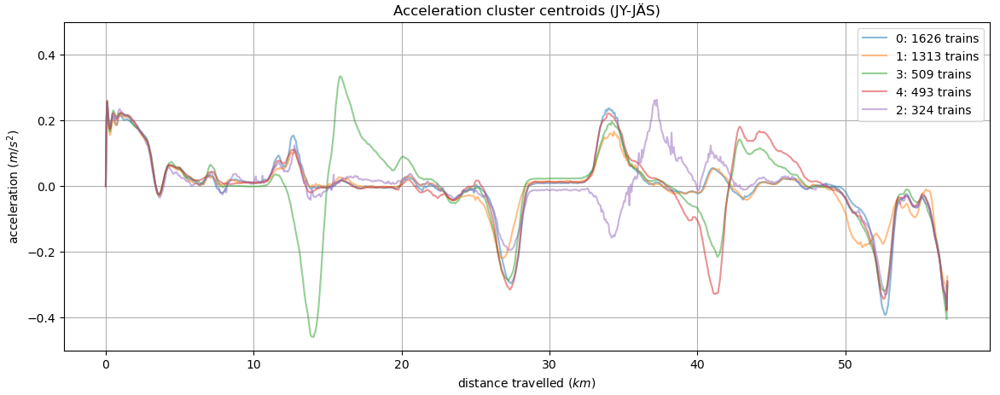

# Junien kiihtyvyyksien tarkastelua

Tämän analyysin yleisen tason tavoitteena on yrittää saada junien liikkeistä tietoa, joka auttaa junien sähkönkulutuksen vähentämiseen. Lisämotivaationa toimii (VR:n) tieto siitä, että junan ajotyyli voi lisätä tai vähentää kulutusta jopa 20 %.

Käytännössä tämä analyysi pyrkii käyttämään avoimesti saatavilla olevaa dataa (erityisesti junien sijanti ja nopeus) junien kiihtyvyyksien tutkimukseen sillä olettamuksella että suuremmat kiihtyvyydet johtavat suurempaan kulutukseen. Valitettavasti sähkönkulutusdatan puuttuessa tätä oletusta ei voi testata tai tarkentaa.

Kiihtyvyyksen tutkimuksen pääasiallinen tulos on junavuorojen luokittelu klustereihin, joiden ominaisuuksia voi yrittää tulkita edelleen. 

Esimerkkinä luokittelusta on alla oleva kuvaaja junaluokkien keskikiihtyvyyksistä.

<!--  -->

Analyysin tulokset löytyvät seuraavista notebookeista:

* [koko_prosessi.ipynb](koko_prosessi.ipynb) sisältää analyysin vaiheet asemien ja päivien valinnasta klusteroinnin tulosten esitykseen.

* [klusterointia.ipynb](klusterointia.ipynb) tarkastelee Jämsä-Orivesi-välin junavuoroja, yrittää klusteroida niitä kiihtyvyyksien perusteella ja tulkita klustereita.

<!-- * notebookissa [datahaku.ipynb](datahaku.ipynb) kerätään analysoitavaksi halutut junavuorot asemavälin ja päivämäärän perusteella -->

* [juna_digitraffic.ipynb](juna_digitraffic.ipynb) tutkailee digitraffic.fi:n [rautatieliikenteeseen liittyviä rajapintoja](https://www.digitraffic.fi/rautatieliikenne/)

* Luultavasti vanhentuneet notebookit: 
  - [klusterointikokeilu.ipynb](klusterointikokeilu.ipynb)
  - [kokeile_skripteja.ipynb](kokeile_skripteja.ipynb)
  - [datahaku.ipynb](datahaku.ipynb)
  - [junailua.ipynb](junailua.ipynb)

<!-- * notebookissa [kokeile_skripteja.ipynb](kokeile_skripteja.ipynb) voi kokeilla datan keräämiseen ja käsittelyyn tarkoitettuja skriptejä

* Ensimmäisiä data-kokeiluja: [junailua.ipynb](junailua.ipynb) ja [klusterointikokeilu.ipynb](klusterointikokeilu.ipynb) -->

Tämä analyysi on suoritettu harjoittelussa JAMKissa kesällä 2023.

<!-- Yhteyshenkilöt:
Mika Rantonen
Janne Alatalo
Tuomo Sipola -->

Liikennetietojen lähde [Fintraffic](https://www.fintraffic.fi/fi) / [Digitraffic](https://www.digitraffic.fi/), lisenssi [CC 4.0 BY](https://creativecommons.org/licenses/by/4.0/).